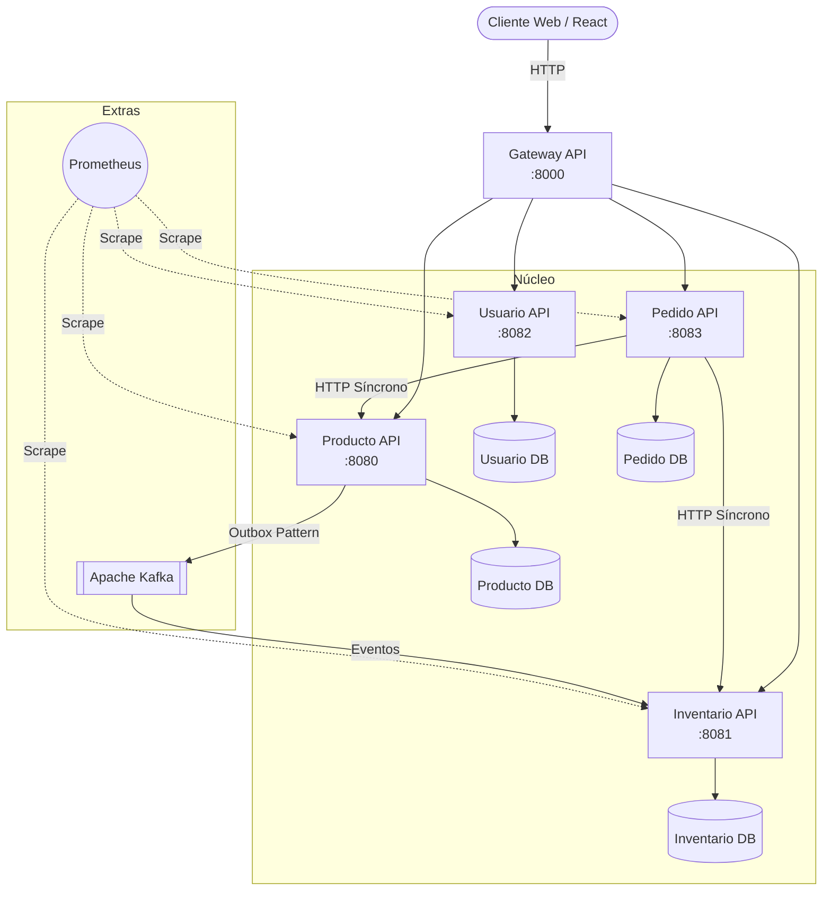

# E-Commerce Microservices Portfolio 

[](https://github.com/DanielMelejPinto/e-commerce/actions)


Este es un proyecto *full-stack* y *cloud-native* que implementa una plataforma de E-Commerce basada en una arquitectura de **microservicios con Spring Boot 4.1.1** y un **frontend SPA con React 19**.

Ha sido desarrollado metódicamente aplicando patrones de diseño avanzados, buenas prácticas de DevOps, seguridad y rendimiento, con el objetivo de demostrar un nivel de ingeniería de software de calidad *senior*.

## Arquitectura



### Servicios Core (Núcleo)
1. **`gateway-api` (Puerto 8000)**: API Gateway (Spring Cloud Gateway) que centraliza el enrutamiento, CORS y simplifica el acceso.
2. **`usuario-api` (Puerto 8082)**: Gestión de identidades, roles (USER, ADMIN) y validación JWT.
3. **`producto-api` (Puerto 8080)**: Catálogo de productos. 
4. **`inventario-api` (Puerto 8081)**: Gestión de stock. Maneja concurrencia de reposición mediante **Optimistic Locking** (`@Version`). Implementa reservas duraderas e idempotentes.
5. **`pedido-api` (Puerto 8083)**: Orquestador central de la **Saga Síncrona**. Controla idempotencia a nivel atómico para evitar cargos duplicados.

### Componentes de Soporte (Extras)
- **Apache Kafka + Patrón Outbox (ShedLock)**: Propaga eventos de creación de productos de `producto-api` a `inventario-api` de forma resiliente para inicializar el stock. Incluye un DLT (Dead Letter Topic) y reprocesamiento en lotes para tolerancia a fallos.
- **Circuit Breaker (Resilience4j)**: Protege a `pedido-api` para reaccionar con Fail-Fast si un servicio dependiente está caído.
- **Prometheus**: Recolección de métricas a través de Spring Boot Actuator.

## Decisiones de Diseño

1. **Carrera de Cancelación de Pedidos**: Al cancelar un pedido concurrentemente, existía el riesgo de liberar el stock múltiples veces si la lectura del estado `CONFIRMADO` y el guardado `CANCELADO` se solapaban. 
   - *Por qué no `@Version`:* El `@Version` en `Pedido` evitaría sobreescribir el estado, pero la excepción saldría *después* de que la llamada a la API externa de inventario ya hubiera liberado el stock.
   - *Solución implementada:* Se utiliza un `UPDATE` condicional atómico (`UPDATE Pedido p SET p.estado = CANCELADO WHERE p.id = :id AND p.estado = CONFIRMADO`). El inventario usa identificadores únicos de reserva vinculados al ID del pedido para garantizar operaciones puramente idempotentes, resolviendo inconsistencias si una solicitud externa falla en su respuesta.
2. **Idempotencia Atómica**: La API de pedidos previene cobros y efectos duplicados mediante `Idempotency-Key` atada atómicamente a la creación del pedido. La clave primaria de la tabla de idempotencia es compuesta (`usuario_id, clave`), bloqueando múltiples requests en curso que compartan clave antes de tocar dependencias externas.
3. **Resiliencia con Kafka**: Para la asincronía eventual en la creación de stock base, se procesa Outbox en lotes y cualquier error del consumidor se envía a un DLT de Kafka (`DeadLetterPublishingRecoverer`), con endpoints administrativos para su reintento y persistencia nativa en disco con Docker Volumes.

## Cómo ejecutar el proyecto en local

Puedes levantar absolutamente todo (PostgreSQL, Kafka, métricas, frontend y backend) con un solo comando:

```bash
cp .env.example .env
docker compose up -d --build
```
Una vez que los contenedores estén `healthy`, accede a `http://localhost:5173`. Para apagar: `docker compose down`.

> **⚠️ IMPORTANTE - Entornos y Seguridad:**
> - El archivo `.env` controla los secretos de BD y JWT del entorno productivo/docker. **Si falta la variable de BD, el compose fallará.**
> - El perfil `dev` de Spring Boot utiliza una base de datos H2 en memoria, y expone credenciales hardcodeadas (como `admin123`) y un secreto JWT débil. Estas credenciales **SOLO son válidas y funcionan bajo el perfil `dev`** y nunca en el despliegue Docker/PostgreSQL.

---
**Autor:** [Daniel Melej Pinto](https://github.com/DanielMelejPinto)
