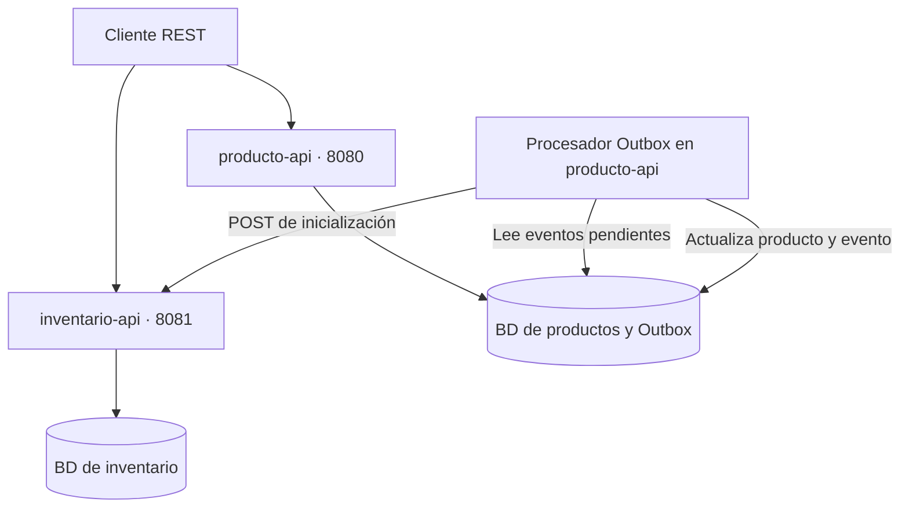

# E-Commerce · Productos e Inventario

Backend de e-commerce desarrollado con **Java 21 y Spring Boot**, organizado en dos microservicios independientes: uno administra el catálogo de productos y otro gestiona sus existencias y reservas.

El proyecto implementa APIs REST, persistencia con JPA, validación de solicitudes, control de concurrencia y un **Transactional Outbox** para coordinar la creación de productos con la inicialización de su inventario.

**Estado:** proyecto de práctica en desarrollo. El alcance actual comprende catálogo e inventario; la interfaz de usuario, autenticación, pedidos y pagos quedan fuera de esta versión.

## Contenido

- [Funcionalidades](#funcionalidades)
- [Tecnologías](#tecnologías)
- [Arquitectura](#arquitectura)
- [Estructura del repositorio](#estructura-del-repositorio)
- [Ejecución local](#ejecución-local)
- [PostgreSQL para productos](#postgresql-para-productos)
- [Documentación de las APIs](#documentación-de-las-apis)
- [Endpoints](#endpoints)
- [Ejemplo de uso](#ejemplo-de-uso)
- [Configuración](#configuración)
- [Validaciones y errores](#validaciones-y-errores)
- [Pruebas](#pruebas)
- [Límites actuales y mejoras propuestas](#límites-actuales-y-mejoras-propuestas)
- [Solución de problemas](#solución-de-problemas)

## Funcionalidades

### Catálogo de productos

- Creación, consulta, actualización y baja lógica de productos.
- Estados `PENDIENTE`, `ACTIVO` y `BAJA`.
- Listado de productos activos con paginación y ordenamiento.
- Lista de campos permitidos para ordenar y desempate por `id`.
- Precios representados con `BigDecimal` y dos decimales.
- Control de concurrencia optimista mediante `@Version`.
- Registro del producto y de su evento Outbox en una misma transacción local.
- Generación de 20 productos de ejemplo con Datafaker en el perfil `dev`.

### Inventario

- Inicialización idempotente: repetir la solicitud conserva el stock existente.
- Consulta de cantidades disponibles y reservadas por producto.
- Ingreso de unidades y reserva de stock.
- Reserva mediante una actualización condicional atómica que exige stock suficiente.
- Restricción única por producto y restricción de cantidades no negativas en el modelo de persistencia.
- Eliminación física del inventario mediante su propio endpoint.

### APIs y pruebas

- DTOs con Java Records y Jakarta Bean Validation.
- Manejo centralizado de excepciones y respuestas de error en JSON.
- Documentación OpenAPI y Swagger UI en ambos servicios.
- Pruebas de servicios, controladores, errores, cliente HTTP, Outbox y documentación.
- Pruebas de concurrencia de inventario con PostgreSQL y Testcontainers.

## Tecnologías

| Tecnología | Versión o uso en el repositorio |
| --- | --- |
| Java | 21 |
| Spring Boot | 4.1.1 |
| Maven | 3.9.16, descargado por Maven Wrapper |
| Spring Web / Web MVC | APIs REST y cliente `RestClient` |
| Spring Data JPA | Repositorios y persistencia |
| Jakarta Validation | Validación de solicitudes |
| H2 | Desarrollo local y parte de las pruebas |
| PostgreSQL | Imagen `postgres:17` para productos y pruebas de inventario |
| springdoc-openapi | 3.1.1 |
| Datafaker | 2.7.0, en `producto-api` |
| JUnit Jupiter, Mockito y MockMvc | Pruebas automatizadas |
| Testcontainers | Integración de inventario con PostgreSQL |
| Docker Compose | Base de datos local de productos |
| Spring Boot Actuator | Dependencia incluida en `inventario-api` |

## Arquitectura

Cada servicio tiene su propio proyecto Maven y su propia persistencia. Internamente, las responsabilidades se distribuyen entre controladores, servicios, repositorios, entidades y DTOs.



### Creación de productos y Outbox

1. El cliente envía `POST /api/productos`.
2. `ProductoService` guarda el producto en estado `PENDIENTE` y un evento de tipo `CREACION` en la misma transacción de base de datos.
3. La API responde `201 Created`, con el producto y la cabecera `Location`, sin esperar la llamada a inventario.
4. `OutboxProcessor` consulta los eventos pendientes y llama a `POST /api/inventarios/producto/{id}`.
5. Según el resultado, actualiza los estados del producto y del evento.

| Resultado del procesamiento | Producto | Evento |
| --- | --- | --- |
| Inicialización HTTP satisfactoria | `ACTIVO` | `ENVIADO` |
| Rechazo HTTP `4xx` | `BAJA` | `ERROR` |
| Error de red, timeout o HTTP `5xx` | Conserva su estado | Permanece pendiente y aumenta `intentos` |
| Producto dado de baja antes del procesamiento | `BAJA` | `ENVIADO`, sin llamar a inventario |
| Producto ausente en la base local | No aplica | `ERROR` |

El procesador usa `@Scheduled(fixedDelay = 5000)`: espera cinco segundos **después de terminar cada ejecución**. Procesa los eventos secuencialmente. La llamada HTTP es bloqueante dentro del proceso de fondo; la integración queda desacoplada de la solicitud original del cliente.

Esta coordinación introduce **consistencia eventual**. Un `201` confirma que se guardó el producto, pero no que el inventario ya esté disponible. Si inventario está caído, la creación puede completarse y quedar pendiente de sincronización.

### Visibilidad y bajas

| Estado del producto | Aparece en el listado | Consulta y actualización por ID |
| --- | --- | --- |
| `PENDIENTE` | No | Permitidas |
| `ACTIVO` | Sí | Permitidas |
| `BAJA` | No | Responden `404` |

La baja del producto conserva su registro y **no elimina ni bloquea automáticamente su inventario**. El endpoint de eliminación de inventario es una operación independiente.

## Estructura del repositorio

| Ruta | Responsabilidad |
| --- | --- |
| `producto-api/` | Proyecto Maven del catálogo |
| `inventario-api/` | Proyecto Maven del inventario |
| `*/src/main/java/` | Código de las aplicaciones |
| `*/src/main/resources/` | Configuración de ejecución |
| `*/src/test/java/` | Pruebas automatizadas |
| `*/src/test/resources/` | Configuración de pruebas |
| `*/pom.xml` | Dependencias y compilación de cada servicio |
| `*/mvnw` y `*/mvnw.cmd` | Maven Wrapper para Unix y Windows |
| `producto-api/docker-compose.yml` | Contenedor PostgreSQL de productos |
| `producto-api/.env.example` | Ejemplo de variables de PostgreSQL |

En los paquetes Java, `controller` define los endpoints; `service`, la lógica de negocio; `repository`, el acceso a datos; `model`, las entidades; `dto`, los contratos HTTP; y `exception`, las excepciones y sus respuestas. Productos también incluye `client` y `config` para la integración HTTP y configuración adicional.

Los servicios se compilan por separado: **no existe un `pom.xml` agregador en la raíz**.

## Ejecución local

### Requisitos

- Git.
- **JDK 21**, con `java` y `javac` disponibles.
- Acceso a Internet para la primera descarga de Maven y dependencias.
- Docker con Docker Compose si se utilizará PostgreSQL o la suite completa de inventario.

No hace falta instalar Maven por separado.

```bash
java -version
javac -version
git clone https://github.com/DanielMelejPinto/e-commerce.git
cd e-commerce
```

### Iniciar los servicios

Abre dos terminales desde la raíz del repositorio y espera a que cada aplicación complete su arranque.

**Terminal 1 — inventario:**

```bash
cd inventario-api
./mvnw spring-boot:run
```

**Terminal 2 — productos:**

```bash
cd producto-api
./mvnw spring-boot:run
```

En PowerShell, sustituye `./mvnw` por `.\mvnw.cmd`.

| Servicio | Dirección | Base de datos local |
| --- | --- | --- |
| Productos | [http://localhost:8080/api/productos](http://localhost:8080/api/productos) | `jdbc:h2:mem:productodb` |
| Inventario | [http://localhost:8081/swagger-ui.html](http://localhost:8081/swagger-ui.html) | `jdbc:h2:mem:inventariodb` |

En esta configuración, las bases H2 están en memoria y se pierden al detener sus procesos.

### Datos de ejemplo

Productos utiliza `dev` como perfil predeterminado. Si la tabla está vacía, inserta 20 productos en estado `ACTIVO`, habilita la consola H2 y muestra las consultas SQL.

**Los productos de ejemplo se insertan directamente en la base: no generan eventos Outbox y no tienen inventario inicializado.** Para probar el flujo completo, crea un producto mediante la API. También puedes inicializar manualmente el inventario de un producto existente mediante su endpoint `POST`.

La consola H2 de productos está disponible en [http://localhost:8080/h2-console](http://localhost:8080/h2-console), con URL JDBC `jdbc:h2:mem:productodb`, usuario `sa` y contraseña vacía en la configuración local predeterminada.

## PostgreSQL para productos

El perfil `docker` conecta **producto-api** a PostgreSQL. El Compose incluido levanta únicamente esa base de datos; las aplicaciones Java se ejecutan con Maven y el inventario mantiene su configuración H2.

Desde la raíz del repositorio:

```bash
cd producto-api
cp .env.example .env
```

Edita `.env` y sustituye `POSTGRES_PASSWORD` por una contraseña propia. Las variables esperadas son:

```dotenv
POSTGRES_DB=productodb
POSTGRES_USER=producto
POSTGRES_PASSWORD=cambia_esta_clave
```

Inicia PostgreSQL y comprueba que el servicio `db` figure como saludable:

```bash
docker compose up -d
docker compose ps
```

Para iniciar productos desde Bash o Zsh, exporta las variables del archivo que acabas de configurar:

```bash
set -a
source ./.env
set +a
./mvnw spring-boot:run -Dspring-boot.run.profiles=docker
```

Usa un `.env` compatible con tu shell; si una contraseña contiene caracteres especiales, escríbela entre comillas simples. Docker Compose carga `.env` por su cuenta, mientras que el proceso Java necesita recibir esas variables en su entorno.

En este perfil no se ejecuta el generador de productos de ejemplo. La base usa el volumen `producto-data` y publica PostgreSQL en `127.0.0.1:5432`.

```bash
# Detener PostgreSQL conservando los datos del volumen
docker compose down
```

**Persistencia mixta:** reiniciar inventario con H2 elimina su stock aunque productos siga conservado en PostgreSQL. Los eventos ya enviados no se reprocesan para reconstruirlo. Para una instalación persistente de ambos servicios, falta configurar una base duradera para inventario.

## Documentación de las APIs

| Servicio | Swagger UI | OpenAPI JSON |
| --- | --- | --- |
| Productos | [Abrir Swagger](http://localhost:8080/swagger-ui.html) | [Abrir OpenAPI](http://localhost:8080/v3/api-docs) |
| Inventario | [Abrir Swagger](http://localhost:8081/swagger-ui.html) | [Abrir OpenAPI](http://localhost:8081/v3/api-docs) |

Ambas aplicaciones deben estar en ejecución para acceder a sus respectivas páginas.

## Endpoints

### Productos · puerto 8080

| Método | Ruta | Operación | Respuestas principales |
| --- | --- | --- | --- |
| `POST` | `/api/productos` | Crear producto pendiente y evento Outbox | `201`, `400` |
| `GET` | `/api/productos` | Listar productos activos | `200`, `400` |
| `GET` | `/api/productos/{id}` | Consultar un producto pendiente o activo | `200`, `400`, `404` |
| `PUT` | `/api/productos/{id}` | Actualizar nombre y precio | `200`, `400`, `404`, `409` |
| `DELETE` | `/api/productos/{id}` | Dar de baja el producto | `204`, `400`, `404`, `409` |

El listado devuelve un objeto con `content` y metadatos `page`: `size`, `number`, `totalElements` y `totalPages`.

| Parámetro | Predeterminado | Comportamiento |
| --- | --- | --- |
| `page` | `0` | Índice de página desde cero |
| `size` | `10` | Se limita a un máximo de 50 |
| `sort` | `id,asc` | Campos permitidos: `id`, `nombre`, `precio`, `fechaCreacion` |

```bash
curl 'http://localhost:8080/api/productos?page=0&size=10&sort=precio,desc'
```

### Inventario · puerto 8081

| Método | Ruta | Operación | Respuestas principales |
| --- | --- | --- | --- |
| `POST` | `/api/inventarios/producto/{productoId}` | Inicializar con ambas cantidades en cero | `201` al crear; `200` si ya existe |
| `GET` | `/api/inventarios/producto/{productoId}` | Consultar stock | `200`, `404` |
| `PUT` | `/api/inventarios/producto/{productoId}/agregar` | Sumar unidades disponibles | `200`, `400`, `404`, `409` |
| `PUT` | `/api/inventarios/producto/{productoId}/reservar` | Mover unidades disponibles a reservadas | `200`, `400`, `404`, `409` |
| `DELETE` | `/api/inventarios/producto/{productoId}` | Eliminar físicamente el inventario | `204`, incluso si no existe |

Un identificador no numérico produce `400`. La inicialización no necesita cuerpo. Agregar y reservar reciben `{"cantidad": 10}`.

La idempotencia corresponde a la **inicialización**. Repetir una solicitud de agregar o reservar vuelve a aplicar la operación; estas rutas no reciben una clave de idempotencia.

## Ejemplo de uso

Los siguientes pasos permiten probar creación, activación, ingreso de stock y reserva con ambos servicios iniciados.

### 1. Crear un producto

```bash
curl -i -X POST http://localhost:8080/api/productos \
  -H 'Content-Type: application/json' \
  -d '{"nombre":"Teclado mecánico","precio":49990.00}'
```

Respuesta ilustrativa `201 Created`:

```json
{
  "id": 21,
  "nombre": "Teclado mecánico",
  "precio": 49990.00,
  "fechaCreacion": "2026-09-29T10:00:00",
  "estado": "PENDIENTE"
}
```

El ID y la fecha dependen de la ejecución. Usa **el ID devuelto por tu solicitud**; no asumas que siempre será `21`.

```bash
# Sustituye 21 por el ID que acabas de recibir
PRODUCTO_ID=21
```

### 2. Comprobar la activación

```bash
curl "http://localhost:8080/api/productos/$PRODUCTO_ID"
```

Repite la consulta hasta observar `"estado":"ACTIVO"`. El tiempo depende del ciclo del procesador, la cantidad de eventos y la disponibilidad de inventario. Mientras esté pendiente, el producto puede consultarse por ID, pero todavía no aparece en el listado.

```bash
curl "http://localhost:8081/api/inventarios/producto/$PRODUCTO_ID"
```

Después de la inicialización, `cantidadDisponible` y `cantidadReservada` valen `0`.

### 3. Agregar diez unidades

```bash
curl -X PUT "http://localhost:8081/api/inventarios/producto/$PRODUCTO_ID/agregar" \
  -H 'Content-Type: application/json' \
  -d '{"cantidad":10}'
```

### 4. Reservar tres unidades

```bash
curl -X PUT "http://localhost:8081/api/inventarios/producto/$PRODUCTO_ID/reservar" \
  -H 'Content-Type: application/json' \
  -d '{"cantidad":3}'
```

Si ejecutaste cada operación una vez sobre un inventario nuevo, el resultado tendrá `cantidadDisponible: 7` y `cantidadReservada: 3`, junto con `productoId` y `ultimaActualizacion`.

### 5. Actualizar o dar de baja el producto

```bash
curl -X PUT "http://localhost:8080/api/productos/$PRODUCTO_ID" \
  -H 'Content-Type: application/json' \
  -d '{"nombre":"Teclado mecánico Pro","precio":59990.00}'

curl -i -X DELETE "http://localhost:8080/api/productos/$PRODUCTO_ID"
```

Después de la baja, la consulta por ID devuelve `404`. El inventario sigue existiendo.

## Configuración

### Perfiles

| Servicio y perfil | Persistencia | Particularidades |
| --- | --- | --- |
| Productos · `dev` predeterminado | H2 en memoria | 20 productos de ejemplo, SQL visible y consola H2 |
| Productos · `docker` | PostgreSQL | Credenciales por variables; `ddl-auto=update` |
| Productos · `test` | H2 | Configuración en `src/test/resources`; `create-drop` |
| Inventario · configuración predeterminada | H2 en memoria | Puerto 8081; `ddl-auto=update` |
| Inventario · `test` | H2 o PostgreSQL según la clase de prueba | Testcontainers en las clases que importan su configuración |

Inventario no incluye un perfil `docker` propio. La presencia del driver PostgreSQL y su uso en Testcontainers no cambian su base de datos de ejecución predeterminada.

### Propiedades de productos

| Propiedad o variable | Valor predeterminado | Uso |
| --- | --- | --- |
| `server.port` | `8080` | Puerto HTTP |
| `inventario.api.url` / `INVENTARIO_API_URL` | `http://localhost:8081` | Dirección de inventario |
| `inventario.api.connect-timeout-ms` | `2000` | Timeout de conexión |
| `inventario.api.read-timeout-ms` | `5000` | Timeout de lectura |
| `outbox.max-intentos` | `5` | Límite de reintentos para eventos fallidos del Outbox |
| `spring.data.web.pageable.max-page-size` | `50` | Límite de paginación |
| `POSTGRES_HOST` | `localhost` | Host de PostgreSQL en el perfil `docker` |
| `POSTGRES_DB` | `productodb` | Nombre de base de datos |
| `POSTGRES_USER` | `producto` | Usuario de base de datos |
| `POSTGRES_PASSWORD` | Sin valor predeterminado | Obligatoria para la conexión del perfil `docker` |

Los valores de PostgreSQL mostrados corresponden a la aplicación. El Compose necesita `POSTGRES_DB`, `POSTGRES_USER` y `POSTGRES_PASSWORD` definidos en `.env` o en el entorno.

Ejemplo de configuración del cliente HTTP, desde `producto-api/`:

```bash
./mvnw spring-boot:run \
  -Dspring-boot.run.arguments="--inventario.api.url=http://localhost:8091 --inventario.api.connect-timeout-ms=3000 --inventario.api.read-timeout-ms=6000"
```

Para usar ese ejemplo, inventario debe estar escuchando en el puerto indicado. El intervalo de procesamiento Outbox está fijado en el código a `5000` ms; no tiene una propiedad de configuración propia.

## Validaciones y errores

| Campo | Restricciones |
| --- | --- |
| `nombre` | Obligatorio, no puede estar en blanco y admite hasta 150 caracteres |
| `precio` | Obligatorio, mayor que cero, hasta 10 dígitos enteros y 2 decimales |
| `cantidad` | Obligatoria, positiva y con máximo de 100000 unidades por operación |

El precio no incluye un campo de moneda. Las cantidades máximas se aplican a cada solicitud de ingreso o reserva.

Los errores de validación de campos devuelven `400` con un mapa de mensajes:

```json
{
  "nombre": "El nombre es obligatorio",
  "precio": "El precio debe ser mayor a cero"
}
```

Las excepciones de negocio manejadas por las aplicaciones utilizan `{"error":"mensaje"}`. Por ejemplo:

```json
{
  "error": "Stock insuficiente para el producto 21: disponible 7, solicitado 10"
}
```

| Código | Situación |
| --- | --- |
| `400 Bad Request` | Validación, JSON inválido, ID no numérico o campo de orden no permitido |
| `404 Not Found` | Producto inexistente o dado de baja; inventario inexistente |
| `409 Conflict` | Stock insuficiente, conflicto de concurrencia o restricción de integridad de inventario |
| `500 Internal Server Error` | Error inesperado; la respuesta omite el detalle interno, que se registra en el servidor |

Las excepciones HTTP que Spring ya reconoce se delegan al framework y pueden utilizar un formato distinto.

## Pruebas

Desde la raíz del repositorio, ejecuta cada módulo por separado:

```bash
(cd producto-api && ./mvnw test)
(cd inventario-api && ./mvnw test)
```

Las clases de prueba de la revisión documentada contienen **88 métodos anotados con `@Test`**:

| Área | Productos | Inventario |
| --- | ---: | ---: |
| Controladores e integración HTTP con MockMvc | 30 | 15 |
| Servicios | 14 | 14 |
| Cliente de inventario | 4 | — |
| Procesador Outbox | 4 | — |
| Manejo de excepciones | 1 | 2 |
| Generación de OpenAPI | 1 | 1 |
| Carga del contexto Spring | 1 | 1 |
| **Total** | **55** | **33** |

Productos usa H2 en sus pruebas de contexto y controladores, y simulaciones de dependencias externas. No necesita otra API levantada.

En inventario, `InventarioControllerTest` y `InventarioApiApplicationTests` usan PostgreSQL 17 con Testcontainers y tienen `disabledWithoutDocker = true`. **Si Docker no está disponible, sus 16 pruebas se omiten**; las pruebas de servicios, errores y OpenAPI no requieren esos contenedores.

Un resultado satisfactorio con pruebas omitidas no confirma la integración ni la concurrencia sobre PostgreSQL. Revisa los contadores de pruebas ejecutadas y omitidas en la salida de Maven o en `target/surefire-reports/` de cada módulo. El número de pruebas declaradas tampoco equivale a un porcentaje de cobertura.

Para compilar, ejecutar las pruebas y generar los JAR:

```bash
(cd producto-api && ./mvnw clean verify)
(cd inventario-api && ./mvnw clean verify)
```

## Límites actuales y mejoras propuestas

El código actual permite practicar integración entre servicios, pero todavía requiere trabajo para una operación productiva.

| Área | Situación actual | Mejora propuesta |
| --- | --- | --- |
| Acceso a las APIs | Endpoints sin autenticación ni autorización | Incorporar identidad, roles y protección de operaciones de escritura |
| Finalización del Outbox | Producto y evento se guardan por separado; el evento no tiene bloqueo ni versión | Hacer atómica la actualización local final y coordinar el procesamiento entre instancias |
| Reintentos | Límite de intentos implementado (5 por defecto), pero consulta todos los pendientes y sin espera progresiva | Procesar por lotes, implementar espera progresiva y habilitar reproceso manual |
| Clasificación HTTP | Todos los `4xx` del inventario se consideran permanentes | Distinguir errores de contrato de respuestas recuperables como `429` |
| Persistencia de inventario | H2 en ejecución local; PostgreSQL en determinadas pruebas | Añadir configuración persistente y un entorno reproducible para ambos servicios |
| Stock y estado del catálogo | Inventario no comprueba la existencia ni el estado del producto | Definir y aplicar reglas entre ambos dominios |
| Reservas | Se acumula cantidad reservada, sin identificar pedidos ni liberar o confirmar reservas | Modelar su ciclo de vida e idempotencia de operaciones |
| Evolución del esquema | Generación y actualización con Hibernate; sin migraciones versionadas | Incorporar Flyway o Liquibase |
| Automatización | Sin workflow de CI ni despliegue completo de las aplicaciones en el repositorio | Ejecutar las suites con Docker en CI y automatizar construcción y despliegue |

La inicialización idempotente facilita reintentar entregas, pero el procesador actual no ofrece una garantía de procesamiento exactamente una vez. Los guardados separados y el manejo de errores de persistencia deben revisarse antes de ejecutar varias instancias o asumir recuperación completa ante fallos.

Las mejoras de esta sección son propuestas; no representan funcionalidades ya implementadas.

## Solución de problemas

| Síntoma | Qué revisar |
| --- | --- |
| Error de compilación relacionado con Java o `release 21` | Comprueba que `java`, `javac` y el JDK seleccionado por Maven correspondan a Java 21 |
| `Permission denied` al ejecutar el wrapper | Desde la raíz, ejecuta `chmod +x producto-api/mvnw inventario-api/mvnw` |
| Producto recién creado ausente del listado | Consulta su estado por ID; comprueba que inventario esté disponible y espera el procesamiento Outbox |
| Inventario `404` para un producto de ejemplo | El generador no crea inventario; inicialízalo o crea otro producto mediante la API |
| Inventario `404` después de reiniciar el servicio | H2 perdió sus datos; productos persistidos no reconstruyen automáticamente los inventarios ya inicializados |
| Reserva con respuesta `409` | Consulta las cantidades disponibles y el mensaje de error antes de decidir si corresponde reintentar |
| Fallo de conexión a PostgreSQL | Revisa `docker compose ps`, puerto 5432 y variables exportadas al proceso Java |
| Pruebas de inventario omitidas | Inicia Docker y vuelve a ejecutar la suite para incluir Testcontainers |
| Puerto 8080 o 8081 ocupado | Detén el proceso que lo usa o cambia `server.port`; si cambias inventario, actualiza también `inventario.api.url` |

## Autor

**Daniel Melej Pinto** · [GitHub](https://github.com/DanielMelejPinto)

## Licencia

El repositorio no incluye un archivo `LICENSE` en la revisión documentada.

---

Documentación contrastada con el código de la rama `main`, commit [`002ff47`](https://github.com/DanielMelejPinto/e-commerce/commit/002ff47f4a7ace5f89beeb4bc7fbad7ec8a9ebcb), del 29 de septiembre de 2026. La revisión fue estática; no se ejecutaron la compilación ni las pruebas en el entorno de preparación de este documento.
