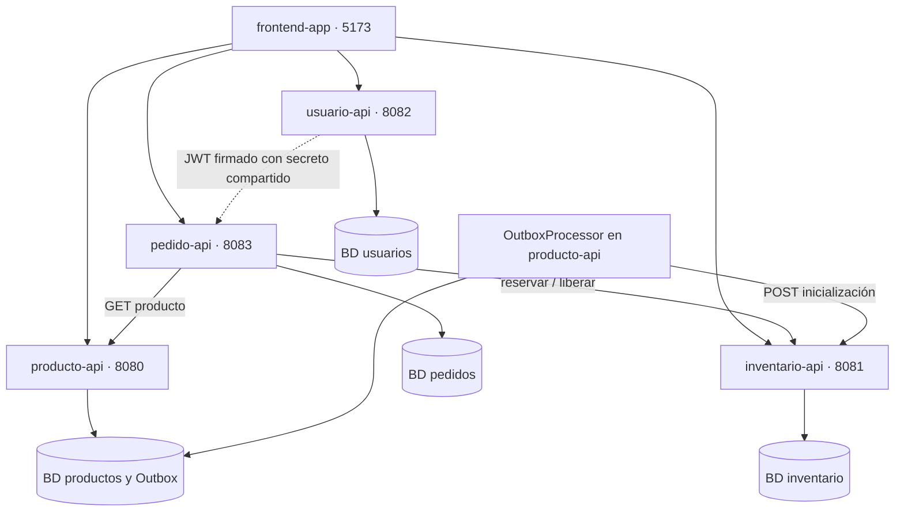

# E-Commerce · Arquitectura de Microservicios

[](https://github.com/DanielMelejPinto/e-commerce/actions/workflows/ci.yml)

Sistema de e-commerce con **cuatro microservicios** en **Java 21 y Spring Boot 4.1.1** y una **tienda web en React**:

| Módulo | Responsabilidad | Puerto |
| --- | --- | --- |
| [`producto-api`](producto-api) | Catálogo de productos | 8080 |
| [`inventario-api`](inventario-api) | Stock disponible y reservado | 8081 |
| [`usuario-api`](usuario-api) | Registro, login y JWT | 8082 |
| [`pedido-api`](pedido-api) | Creación de pedidos (orquesta producto e inventario) | 8083 |
| [`frontend-app`](frontend-app) | Tienda React + panel de administración | 5173 (Vite) |

Características principales:

- **Transactional Outbox** entre `producto-api` e `inventario-api`: el producto se guarda y el inventario se inicializa de forma asíncrona.
- **Autenticación con JWT** (`usuario-api` emite el token; `pedido-api` lo valida con el mismo secreto).
- **Saga compensatoria** en `pedido-api`: si un pedido falla a mitad de camino, libera el stock ya reservado.
- **Concurrencia optimista** (`@Version`) y **reserva atómica** de stock en base de datos.
- **CI** en GitHub Actions: `./mvnw -B verify` para los cuatro módulos.

**Estado:** proyecto de práctica en desarrollo. Cubre catálogo, inventario, usuarios, pedidos y un frontend básico (catálogo, login/registro, carrito, historial de pedidos y administración de productos). Ver [límites actuales](#límites-actuales-y-mejoras-propuestas).

## Contenido

- [Funcionalidades](#funcionalidades)
- [Tecnologías](#tecnologías)
- [Arquitectura](#arquitectura)
- [Estructura del repositorio](#estructura-del-repositorio)
- [Ejecución local](#ejecución-local)
- [PostgreSQL para productos](#postgresql-para-productos)
- [Documentación de las APIs](#documentación-de-las-apis)
- [Endpoints](#endpoints)
- [Ejemplo de uso](#ejemplo-de-uso)
- [Configuración](#configuración)
- [Validaciones y errores](#validaciones-y-errores)
- [Pruebas y CI](#pruebas-y-ci)
- [Límites actuales y mejoras propuestas](#límites-actuales-y-mejoras-propuestas)
- [Solución de problemas](#solución-de-problemas)

## Funcionalidades

### Catálogo de productos (`producto-api`)

- Creación, consulta, actualización y baja lógica de productos (con `descripcion` e `imagenUrl` opcionales).
- Estados `PENDIENTE`, `ACTIVO` y `BAJA`.
- Listado de productos activos con paginación y ordenamiento por campos permitidos.
- Precios con `BigDecimal` y dos decimales.
- Registro del producto y de su evento Outbox en una misma transacción local.
- 20 productos de ejemplo con Datafaker en el perfil `dev`.

### Inventario (`inventario-api`)

- Inicialización idempotente: repetir la solicitud conserva el stock existente.
- Consulta de cantidades disponibles y reservadas por producto.
- Ingreso de unidades, reserva y **liberación** de stock.
- Reserva mediante una actualización condicional atómica que exige stock suficiente.
- Eliminación física del inventario mediante su propio endpoint.

### Usuarios (`usuario-api`)

- Registro (siempre con rol `USER`), login con JWT y consulta del perfil propio (`/me`).
- Contraseñas con BCrypt (costo configurable) y sesiones stateless.
- Roles `USER` y `ADMIN`.

### Pedidos (`pedido-api`)

- Creación de pedidos autenticados: consulta el precio real en `producto-api`, reserva stock en `inventario-api` y guarda el pedido como `CONFIRMADO`.
- Compensación: si falla un ítem, libera el stock de los ítems ya reservados.
- Listado de los pedidos del usuario autenticado.

### Frontend (`frontend-app`)

- Catálogo, registro, login, carrito, perfil con historial de pedidos y panel `/admin` para crear productos y agregar stock.

## Tecnologías

| Tecnología | Versión o uso en el repositorio |
| --- | --- |
| Java | 21 |
| Spring Boot | 4.1.1 |
| Maven | Descargado por Maven Wrapper (`mvnw`) |
| Spring Web MVC y `RestClient` | APIs REST y comunicación entre servicios |
| Spring Data JPA | Repositorios y persistencia |
| Spring Security + jjwt | JWT en `usuario-api` y `pedido-api` (jjwt 0.12.5) |
| Jakarta Validation | Validación de solicitudes |
| H2 | Base local en memoria de los cuatro servicios y parte de las pruebas |
| PostgreSQL | Imagen `postgres:17` para productos y pruebas de inventario |
| springdoc-openapi | 3.1.1 (Swagger UI) |
| Datafaker | Datos de ejemplo en `producto-api` |
| JUnit, Mockito, MockMvc | Pruebas automatizadas |
| Testcontainers | Integración de inventario con PostgreSQL |
| Docker Compose | Base de datos local de productos |
| React 19, TypeScript, Vite | Frontend (Axios, React Router) |
| GitHub Actions | CI (`.github/workflows/ci.yml`) |


## Inicio rápido con Docker (Recomendado)

Para levantar toda la arquitectura (PostgreSQL, los 4 microservicios Java y el Frontend en React) con un solo comando:

```bash
cp .env.example .env
# Ajusta JWT_SECRET en .env si vas a usarlo en producción
docker compose up --build
```

- **Frontend**: http://localhost:5173
- **Swagger UI (Producto)**: http://localhost:8080/swagger-ui/index.html

## Arquitectura

Cada servicio tiene su propio proyecto Maven y su propia base de datos. El frontend llama a las APIs a través del proxy de Vite.



### Creación de productos y Outbox

1. El cliente envía `POST /api/productos`.
2. `ProductoService` guarda el producto en estado `PENDIENTE` y un evento `CREACION` en la misma transacción.
3. La API responde `201 Created` con la cabecera `Location`, sin esperar a inventario.
4. `OutboxProcessor` consulta los eventos pendientes y llama a `POST /api/inventarios/producto/{id}`.
5. Según el resultado, actualiza los estados del producto y del evento.

| Resultado del procesamiento | Producto | Evento |
| --- | --- | --- |
| Inicialización HTTP satisfactoria | `ACTIVO` | `ENVIADO` |
| Rechazo HTTP `4xx` | `BAJA` | `ERROR` |
| Error de red, timeout o HTTP `5xx` | Conserva su estado | Permanece pendiente y aumenta `intentos` |
| Producto dado de baja antes del procesamiento | `BAJA` | `ENVIADO`, sin llamar a inventario |
| Producto ausente en la base local | No aplica | `ERROR` |

El procesador usa `@Scheduled(fixedDelay = 5000)`: espera cinco segundos **después de terminar cada ejecución** y procesa los eventos de forma secuencial. Esto introduce **consistencia eventual**: un `201` confirma que se guardó el producto, no que el inventario ya esté disponible.

### Visibilidad y bajas

| Estado del producto | Aparece en el listado | Consulta y actualización por ID |
| --- | --- | --- |
| `PENDIENTE` | No | Permitidas |
| `ACTIVO` | Sí | Permitidas |
| `BAJA` | No | Responden `404` |

La baja conserva el registro y **no elimina ni bloquea automáticamente su inventario**. El `DELETE` de inventario es una operación independiente.

### Creación de pedidos

1. El cliente envía `POST /api/pedidos` con `Authorization: Bearer <token>`.
2. `pedido-api` valida el JWT y toma el `userId` del token (no del cuerpo de la solicitud).
3. Para cada ítem: obtiene el producto en `producto-api` (precio actual) y reserva stock con `PUT .../reservar`.
4. Si todo sale bien, guarda el pedido como `CONFIRMADO` con el total calculado.
5. Si algo falla, llama a `PUT .../liberar` por cada ítem ya reservado, relanza el error y no guarda el pedido.

La compensación es de mejor esfuerzo: si `liberar` también falla, solo se escribe un mensaje en `System.err` y el stock queda reservado sin pedido.

## Estructura del repositorio

| Ruta | Responsabilidad |
| --- | --- |
| `producto-api/` | Proyecto Maven del catálogo |
| `inventario-api/` | Proyecto Maven del inventario |
| `usuario-api/` | Proyecto Maven de usuarios y autenticación (JWT) |
| `pedido-api/` | Proyecto Maven de pedidos |
| `frontend-app/` | Aplicación React + TypeScript + Vite |
| `.github/workflows/ci.yml` | Pipeline de CI |
| `*/src/main/java/` | Código de las aplicaciones |
| `*/src/main/resources/` | Configuración de ejecución |
| `*/src/test/` | Pruebas automatizadas |
| `*/pom.xml` | Dependencias y compilación de cada servicio |
| `*/mvnw` y `*/mvnw.cmd` | Maven Wrapper para Unix y Windows |
| `producto-api/docker-compose.yml` | Contenedor PostgreSQL de productos |
| `producto-api/.env.example` | Ejemplo de variables de PostgreSQL |

Los servicios se compilan por separado: **no existe un `pom.xml` agregador en la raíz**.

## Ejecución local

### Requisitos

- Git.
- **JDK 21**, con `java` y `javac` disponibles.
- **Node.js** y npm, solo para el frontend.
- Acceso a Internet para la primera descarga de dependencias.
- Docker con Docker Compose, si se usará PostgreSQL o la suite completa de inventario.

```bash
java -version
git clone https://github.com/DanielMelejPinto/e-commerce.git
cd e-commerce
```

### Secreto JWT compartido

`usuario-api` firma los tokens y `pedido-api` los verifica: **ambos deben usar el mismo secreto** (mínimo 32 caracteres para HS256).

```bash
export JWT_SECRET='pon_aqui_un_secreto_largo_de_al_menos_32_caracteres'
export SEGURIDAD_JWT_SECRET="$JWT_SECRET"
```

- `usuario-api` lee `JWT_SECRET`; si no existe, usa una clave de desarrollo incluida en `application.properties`.
- `pedido-api` **no define un valor por defecto** para `seguridad.jwt.secret`: si no se lo entregas (por ejemplo con `SEGURIDAD_JWT_SECRET`), no arranca.

### Iniciar los servicios

Abre una terminal por servicio, desde la raíz del repositorio, con las variables anteriores exportadas. Para probar el flujo completo, inicia primero inventario y usuario.

```bash
(cd inventario-api && ./mvnw spring-boot:run)   # Terminal 1 · 8081
(cd producto-api   && ./mvnw spring-boot:run)   # Terminal 2 · 8080
(cd usuario-api    && ./mvnw spring-boot:run)   # Terminal 3 · 8082
(cd pedido-api     && ./mvnw spring-boot:run)   # Terminal 4 · 8083
```

En PowerShell, sustituye `./mvnw` por `.\mvnw.cmd`.

### Iniciar el frontend

```bash
cd frontend-app
npm install
npm run dev
```

La tienda queda en <http://localhost:5173>. El servidor de Vite redirige `/api/productos`, `/api/inventarios`, `/api/usuarios` y `/api/pedidos` a los puertos 8080, 8081, 8082 y 8083.

| Servicio | Dirección | Base de datos local |
| --- | --- | --- |
| Productos | <http://localhost:8080/api/productos> | `jdbc:h2:mem:productodb` |
| Inventario | <http://localhost:8081/swagger-ui.html> | `jdbc:h2:mem:inventariodb` |
| Usuarios | <http://localhost:8082/swagger-ui.html> | `jdbc:h2:mem:usuariodb` |
| Pedidos | <http://localhost:8083/api/pedidos> (requiere JWT) | `jdbc:h2:mem:pedidodb` |

Las bases H2 están en memoria y **se pierden al detener cada proceso**.

### Datos de ejemplo

Productos usa `dev` como perfil predeterminado. Si la tabla está vacía, inserta 20 productos `ACTIVO`, habilita la consola H2 y muestra el SQL.

**Los productos de ejemplo se insertan directo en la base: no generan eventos Outbox y no tienen inventario.** Para probar el flujo completo, crea un producto por la API (o desde `/admin` en el frontend), o inicializa manualmente su inventario con el `POST` de inventario.

La consola H2 de productos está en <http://localhost:8080/h2-console> (URL JDBC `jdbc:h2:mem:productodb`, usuario `sa`, contraseña vacía).

### Crear un usuario administrador

El registro **siempre crea usuarios con rol `USER`** y no existe un endpoint para promover a `ADMIN`. Para acceder a `/admin` en el frontend hay que cambiar el rol directamente en la base de `usuario-api` (por ejemplo desde su consola H2 en <http://localhost:8082/h2-console>, URL `jdbc:h2:mem:usuariodb`) y volver a iniciar sesión. Como la base está en memoria, esto se repite en cada reinicio.

## PostgreSQL para productos

El perfil `docker` conecta **producto-api** a PostgreSQL. El Compose incluido levanta únicamente esa base; las aplicaciones Java se ejecutan con Maven y el resto de servicios sigue con H2.

```bash
cd producto-api
cp .env.example .env
```

Edita `.env` y cambia `POSTGRES_PASSWORD`:

```dotenv
POSTGRES_DB=productodb
POSTGRES_USER=producto
POSTGRES_PASSWORD=cambia_esta_clave
```

```bash
docker compose up -d
docker compose ps        # el servicio db debe figurar como healthy

set -a
source ./.env
set +a
./mvnw spring-boot:run -Dspring-boot.run.profiles=docker
```

Si la contraseña tiene caracteres especiales, escríbela entre comillas simples en el `.env`. Docker Compose carga `.env` por su cuenta, pero el proceso Java necesita las variables en su entorno.

En este perfil no se ejecuta el generador de datos de ejemplo. Los datos viven en el volumen `producto-data` y PostgreSQL se publica en `127.0.0.1:5432`.

```bash
docker compose down        # detiene la base conservando los datos
docker compose down -v     # detiene y borra también los datos
```

**Persistencia mixta:** si reinicias inventario (H2) su stock se pierde aunque productos siga en PostgreSQL. Los eventos ya enviados no se reprocesan.

## Documentación de las APIs

| Servicio | Swagger UI | OpenAPI JSON |
| --- | --- | --- |
| Productos | <http://localhost:8080/swagger-ui.html> | <http://localhost:8080/v3/api-docs> |
| Inventario | <http://localhost:8081/swagger-ui.html> | <http://localhost:8081/v3/api-docs> |
| Usuarios | <http://localhost:8082/swagger-ui.html> | <http://localhost:8082/v3/api-docs> |
| Pedidos | Protegido por JWT (ver [`pedido-api`](pedido-api/README.md)) | Protegido por JWT |

Cada aplicación debe estar en ejecución para acceder a sus páginas.

## Endpoints

### Productos · 8080

| Método | Ruta | Operación | Respuestas principales |
| --- | --- | --- | --- |
| `POST` | `/api/productos` | Crear producto pendiente y evento Outbox | `201`, `400` |
| `GET` | `/api/productos` | Listar productos activos | `200`, `400` |
| `GET` | `/api/productos/{id}` | Consultar un producto pendiente o activo | `200`, `400`, `404` |
| `PUT` | `/api/productos/{id}` | Actualizar producto | `200`, `400`, `404`, `409` |
| `DELETE` | `/api/productos/{id}` | Dar de baja (borrado lógico) | `204`, `400`, `404`, `409` |

El listado devuelve `content` y un objeto `page` con `size`, `number`, `totalElements` y `totalPages`.

| Parámetro | Predeterminado | Comportamiento |
| --- | --- | --- |
| `page` | `0` | Índice de página desde cero |
| `size` | `10` | Máximo 50 |
| `sort` | `id,asc` | Campos permitidos: `id`, `nombre`, `precio`, `fechaCreacion` |

```bash
curl 'http://localhost:8080/api/productos?page=0&size=10&sort=precio,desc'
```

### Inventario · 8081

| Método | Ruta | Operación | Respuestas principales |
| --- | --- | --- | --- |
| `POST` | `/api/inventarios/producto/{productoId}` | Inicializar con ambas cantidades en cero | `201` al crear; `200` si ya existe |
| `GET` | `/api/inventarios/producto/{productoId}` | Consultar stock | `200`, `404` |
| `PUT` | `/api/inventarios/producto/{productoId}/agregar` | Sumar unidades disponibles | `200`, `400`, `404`, `409` |
| `PUT` | `/api/inventarios/producto/{productoId}/reservar` | Mover unidades de disponibles a reservadas | `200`, `400`, `404`, `409` |
| `PUT` | `/api/inventarios/producto/{productoId}/liberar` | Devolver unidades reservadas a disponibles (lo usa `pedido-api`) | `200` |
| `DELETE` | `/api/inventarios/producto/{productoId}` | Eliminar físicamente el inventario | `204`, incluso si no existe |

Agregar, reservar y liberar reciben `{"cantidad": 10}`. La idempotencia es solo de la **inicialización**: repetir agregar, reservar o liberar vuelve a aplicar la operación.

### Usuarios · 8082

| Método | Ruta | Acceso | Operación | Respuestas principales |
| --- | --- | --- | --- | --- |
| `POST` | `/api/usuarios/registro` | Público | Registrar usuario (rol `USER`) | `201`, `400`, `409` |
| `POST` | `/api/usuarios/login` | Público | Iniciar sesión; devuelve `{"token": "..."}` | `200`, `400`, `401` |
| `GET` | `/api/usuarios/me` | JWT | Perfil del usuario autenticado | `200`, `403` |

### Pedidos · 8083 (todo requiere JWT)

| Método | Ruta | Operación | Respuestas principales |
| --- | --- | --- | --- |
| `POST` | `/api/pedidos` | Crear un pedido del usuario autenticado | `201`, `400` |
| `GET` | `/api/pedidos/mis-pedidos` | Listar los pedidos del usuario autenticado | `200` |

## Ejemplo de uso

Con los cuatro servicios iniciados y el secreto JWT compartido configurado.

### 1. Registrarse e iniciar sesión

```bash
curl -X POST http://localhost:8082/api/usuarios/registro \
  -H 'Content-Type: application/json' \
  -d '{"nombre":"Ana Pérez","email":"ana@mail.com","password":"ClaveSegura1"}'

curl -X POST http://localhost:8082/api/usuarios/login \
  -H 'Content-Type: application/json' \
  -d '{"email":"ana@mail.com","password":"ClaveSegura1"}'
```

Guarda el token de la respuesta:

```bash
TOKEN='pega_aqui_el_token'
```

### 2. Crear un producto

```bash
curl -i -X POST http://localhost:8080/api/productos \
  -H 'Content-Type: application/json' \
  -d '{"nombre":"Teclado mecánico","precio":49990.00,"descripcion":"Teclado RGB","imagenUrl":"https://ejemplo.com/teclado.jpg"}'
```

Respuesta ilustrativa `201 Created`:

```json
{
  "id": 21,
  "nombre": "Teclado mecánico",
  "precio": 49990.00,
  "descripcion": "Teclado RGB",
  "imagenUrl": "https://ejemplo.com/teclado.jpg",
  "fechaCreacion": "2026-09-29T10:00:00",
  "estado": "PENDIENTE"
}
```

Usa **el ID devuelto por tu solicitud** (no asumas que será `21`):

```bash
PRODUCTO_ID=21
```

### 3. Esperar la activación y cargar stock

```bash
curl "http://localhost:8080/api/productos/$PRODUCTO_ID"                # repite hasta ver "estado":"ACTIVO"
curl "http://localhost:8081/api/inventarios/producto/$PRODUCTO_ID"     # ambas cantidades en 0

curl -X PUT "http://localhost:8081/api/inventarios/producto/$PRODUCTO_ID/agregar" \
  -H 'Content-Type: application/json' -d '{"cantidad":10}'
```

Mientras esté `PENDIENTE`, el producto se puede consultar por ID pero no aparece en el listado.

### 4. Crear un pedido

```bash
curl -i -X POST http://localhost:8083/api/pedidos \
  -H "Authorization: Bearer $TOKEN" \
  -H 'Content-Type: application/json' \
  -d "{\"items\":[{\"productoId\":$PRODUCTO_ID,\"cantidad\":3}]}"
```

El inventario queda con `cantidadDisponible: 7` y `cantidadReservada: 3`. Consulta tus pedidos con:

```bash
curl -H "Authorization: Bearer $TOKEN" http://localhost:8083/api/pedidos/mis-pedidos
```

### 5. Actualizar o dar de baja el producto

```bash
curl -X PUT "http://localhost:8080/api/productos/$PRODUCTO_ID" \
  -H 'Content-Type: application/json' \
  -d '{"nombre":"Teclado mecánico Pro","precio":59990.00}'

curl -i -X DELETE "http://localhost:8080/api/productos/$PRODUCTO_ID"
```

Después de la baja, la consulta por ID devuelve `404`; el inventario sigue existiendo.

## Configuración

### Puertos y perfiles

| Servicio | Puerto | Perfil por defecto | Persistencia |
| --- | --- | --- | --- |
| `producto-api` | 8080 | `dev` (`docker` con PostgreSQL, `test` en pruebas) | H2 en memoria |
| `inventario-api` | 8081 | predeterminado | H2 en memoria; `test` puede usar PostgreSQL con Testcontainers |
| `usuario-api` | 8082 | `dev` | H2 en memoria |
| `pedido-api` | 8083 | predeterminado | H2 en memoria |

Inventario no tiene perfil `docker`: que el driver de PostgreSQL esté en el `pom.xml` no cambia su base de ejecución.

### Propiedades de productos

| Propiedad o variable | Predeterminado | Uso |
| --- | --- | --- |
| `server.port` | `8080` | Puerto HTTP |
| `inventario.api.url` / `INVENTARIO_API_URL` | `http://localhost:8081` | Dirección de inventario |
| `inventario.api.connect-timeout-ms` | `2000` | Timeout de conexión |
| `inventario.api.read-timeout-ms` | `5000` | Timeout de lectura |
| `outbox.max-intentos` | `5` | Reintentos máximos de eventos Outbox |
| `spring.data.web.pageable.max-page-size` | `50` | Límite de paginación |
| `POSTGRES_HOST` | `localhost` | Host de PostgreSQL (perfil `docker`) |
| `POSTGRES_DB` | `productodb` | Base de datos |
| `POSTGRES_USER` | `producto` | Usuario |
| `POSTGRES_PASSWORD` | Sin valor | Obligatoria en el perfil `docker` |

El intervalo del Outbox está fijo en `5000` ms en el código; no tiene propiedad propia.

### Propiedades de usuarios

| Propiedad o variable | Predeterminado | Uso |
| --- | --- | --- |
| `server.port` | `8082` | Puerto HTTP |
| `seguridad.jwt.secret` / `JWT_SECRET` | Clave de desarrollo | Secreto de firma del JWT (**cámbialo fuera de local**) |
| `seguridad.jwt.expiration-ms` | `86400000` | Vigencia del token (1 día) |
| `seguridad.bcrypt-cost` | `12` | Costo de BCrypt |

### Propiedades de pedidos

| Propiedad | Predeterminado | Uso |
| --- | --- | --- |
| `server.port` | `8083` | Puerto HTTP |
| `seguridad.jwt.secret` | **Sin valor** | Debe ser igual al de `usuario-api` (por ejemplo vía `SEGURIDAD_JWT_SECRET`) |
| `api.producto.url` | `http://localhost:8080/api/productos` | Base de `producto-api` |
| `api.inventario.url` | `http://localhost:8081/api/inventarios` | Base de `inventario-api` |
| `api.usuario.url` | `http://localhost:8082/api/usuarios` | Definida, pero el código actual no la usa |

## Validaciones y errores

| Campo | Restricciones |
| --- | --- |
| Producto · `nombre` | Obligatorio, no vacío, máximo 150 caracteres |
| Producto · `precio` | Obligatorio, mayor que cero, hasta 10 enteros y 2 decimales |
| Usuario · `nombre` | Obligatorio, máximo 150 caracteres |
| Usuario · `email` | Obligatorio, formato válido, máximo 254 caracteres (se guarda en minúsculas) |
| Usuario · `password` | Obligatoria, entre 8 y 72 caracteres |
| Inventario · `cantidad` | Obligatoria, positiva, máximo 100000 por operación |
| Pedido · `items` | Al menos un ítem |
| Pedido · `productoId` / `cantidad` | Obligatorios; `cantidad` mínima 1 |

Los errores de validación devuelven `400` con un mapa campo → mensaje; las excepciones de negocio usan `{"error":"mensaje"}`:

```json
{ "nombre": "El nombre es obligatorio", "precio": "El precio debe ser mayor a cero" }
```

```json
{ "error": "Stock insuficiente para el producto 21: disponible 7, solicitado 10" }
```

| Código | Situación |
| --- | --- |
| `400` | Validación, JSON inválido, ID no numérico o campo de orden no permitido |
| `401` | Credenciales incorrectas en el login |
| `403` | `/api/usuarios/me` sin token válido |
| `404` | Producto inexistente o dado de baja; inventario inexistente |
| `409` | Stock insuficiente, conflicto de concurrencia, email ya registrado o restricción de integridad |
| `500` | Error inesperado; el detalle se registra en el servidor |

`pedido-api` no tiene manejador global de excepciones: los errores de `producto-api` o `inventario-api` (por ejemplo, stock insuficiente) no se traducen a un código propio. Ver su [README](pedido-api/README.md).

## Pruebas y CI

Cada módulo se prueba por separado:

```bash
(cd producto-api   && ./mvnw test)
(cd inventario-api && ./mvnw test)
(cd usuario-api    && ./mvnw test)
(cd pedido-api     && ./mvnw test)
```

Para compilar, probar y generar los JAR: `./mvnw clean verify` dentro de cada módulo.

- Las pruebas de productos no necesitan Docker ni otra API levantada (H2 y dependencias simuladas).
- En inventario, `InventarioControllerTest` y `InventarioApiApplicationTests` usan PostgreSQL 17 con Testcontainers y `disabledWithoutDocker = true`: **sin Docker se omiten**. Un resultado exitoso con pruebas omitidas no confirma la integración ni la concurrencia sobre PostgreSQL; revisa la salida de Maven o `target/surefire-reports/`.
- El frontend no tiene pruebas automatizadas; `npm run lint` ejecuta Oxlint y `npm run build` valida TypeScript.

**CI:** el workflow `.github/workflows/ci.yml` corre en cada push y pull request a `main`, con una matriz de los cuatro módulos (`ubuntu-24.04`, JDK 21 Temurin, `./mvnw -B verify`). No incluye el frontend ni despliegue.

## Límites actuales y mejoras propuestas

El código permite practicar integración entre servicios, pero todavía requiere trabajo para producción.

| Área | Situación actual | Mejora propuesta |
| --- | --- | --- |
| Acceso a producto e inventario | Sin autenticación ni autorización: cualquiera con acceso a los puertos 8080/8081 puede crear productos o modificar stock | Validar el JWT y exigir rol `ADMIN` en las operaciones de escritura |
| Rol de administrador | `/admin` solo se protege en el frontend (revisa el rol en el cliente); no hay forma de crear un `ADMIN` por la API | Autorizar por rol en el backend y definir cómo se asigna |
| Secreto JWT | Secreto compartido por variable de entorno; `pedido-api` no arranca sin él y la clave por defecto de `usuario-api` es pública | Gestionar el secreto fuera del repositorio; considerar claves asimétricas |
| Finalización del Outbox | Producto y evento se guardan por separado; el evento no tiene bloqueo ni versión | Hacer atómica la actualización final y coordinar varias instancias |
| Reintentos del Outbox | Límite de 5 intentos, pero consulta todos los pendientes y sin espera progresiva | Procesar por lotes, espera progresiva y reproceso manual |
| Clasificación HTTP | Todos los `4xx` de inventario se consideran permanentes | Distinguir errores de contrato de respuestas recuperables como `429` |
| Compensación de pedidos | **¡Resuelto!** Usa `slf4j` logger en vez de `System.err` | Cola de reintentos o *dead letter* |
| Pedidos e idempotencia | Reintentar `POST /api/pedidos` tras un timeout puede reservar dos veces; el estado siempre es `CONFIRMADO` (no hay pago, cancelación ni ciclo de vida) | Clave de idempotencia y estados de pedido |
| Errores de pedidos | **¡Resuelto!** Se agregó un `@RestControllerAdvice` global que traduce los errores (404, 409, 503) | Manejo de excepciones unificado |
| Persistencia | **¡Resuelto!** Todos los servicios utilizan PostgreSQL mediante Docker Compose | Base persistente para todos y un entorno reproducible (Compose completo) |
| Stock y catálogo | Inventario no comprueba que el producto exista ni su estado | Definir reglas entre ambos dominios |
| Esquema | **¡Resuelto!** Todos los servicios utilizan Flyway para migraciones versionadas con validación | Migraciones con Flyway |
| Automatización | CI ejecuta los módulos Java; sin frontend ni despliegue | Agregar build/lint del frontend y despliegue |

La inicialización idempotente facilita reintentar entregas, pero el Outbox actual no garantiza procesamiento exactamente una vez. Las mejoras de esta sección son propuestas, no funcionalidades implementadas.

## Solución de problemas

| Síntoma | Qué revisar |
| --- | --- |
| Error de compilación por Java o `release 21` | Comprueba que `java`, `javac` y el JDK de Maven sean Java 21 |
| `Permission denied` al ejecutar el wrapper | `chmod +x */mvnw` desde la raíz |
| `pedido-api` no arranca (`Could not resolve placeholder 'seguridad.jwt.secret'`) | Exporta `SEGURIDAD_JWT_SECRET` con el mismo valor que usa `usuario-api` |
| `401`/`403` al crear un pedido | Falta el header `Authorization: Bearer <token>`, el token expiró o los secretos de `usuario-api` y `pedido-api` no coinciden |
| Producto recién creado ausente del listado | Consulta su estado por ID; verifica que inventario esté disponible y espera el Outbox |
| Inventario `404` para un producto de ejemplo | El generador no crea inventario; inicialízalo o crea otro producto por la API |
| Inventario `404` tras reiniciar | H2 perdió sus datos; el Outbox no reconstruye inventarios ya enviados |
| Pedido falla con error de conexión | Verifica que producto (8080) e inventario (8081) estén levantados |
| Pedido falla por stock | Agrega stock al producto (`/agregar`) y revisa `cantidadDisponible` |
| No puedo entrar a `/admin` | Tu usuario debe tener rol `ADMIN` en la base de `usuario-api`; vuelve a iniciar sesión tras el cambio |
| Fallo de conexión a PostgreSQL | Revisa `docker compose ps`, el puerto 5432 y las variables exportadas al proceso Java |
| Pruebas de inventario omitidas | Inicia Docker y vuelve a ejecutar la suite |
| Puerto ocupado | Detén el proceso que lo usa o cambia `server.port` (y las URLs que apunten a él) |

## Autor

**Daniel Melej Pinto** · [GitHub](https://github.com/DanielMelejPinto)

## Licencia

Este proyecto está bajo la Licencia MIT. Consulta el archivo [LICENSE](LICENSE) para más detalles.
